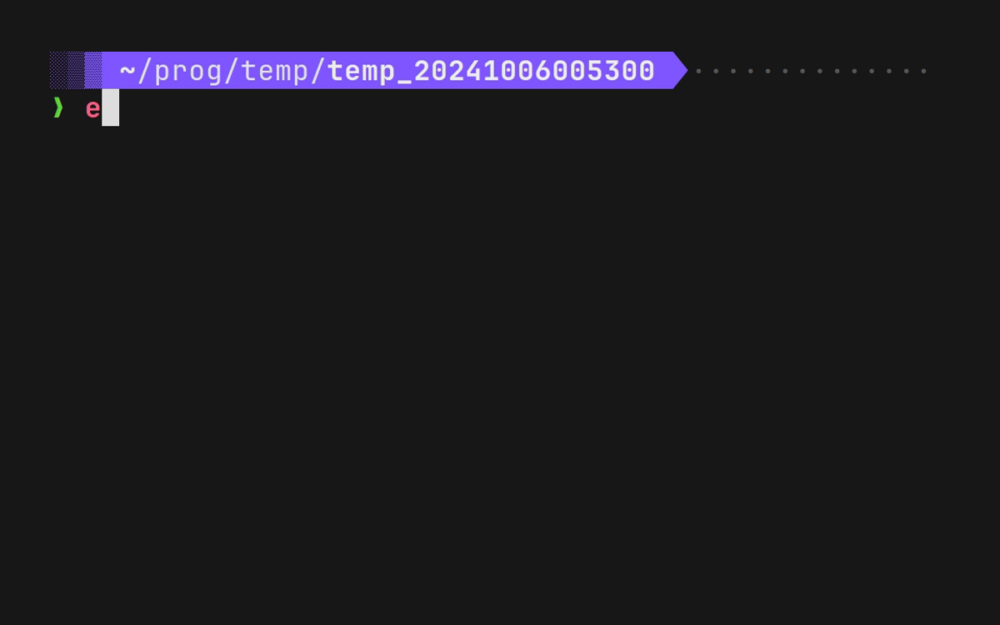

# complete-lastf

一个zsh插件,进行文件名补全,比如将用户的`lastf`替换为当前目录最后一个修改的文件

## 效果图



## 功能

暂时约定 **最后一个文件** 特指当前目录最后一个被编辑的文件

1. `lastfN`替换为最后N个文件

   比如`lastf2`替换为最后2个文件

   没有N即`lastf`时默认1

2. `lastdN`替换为最后N个文件夹

## 依赖

- [eza](https://github.com/eza-community/eza) `ls`的现代替代.`-D`参数可以仅仅列出文件夹,而`ls`较为困难

## 安装

1. 克隆仓库到 `~/.oh-my-zsh/custom/plugins/complete-lastf`

2. 在`~/.zshrc`文件中写

   ```shell
   plugins=(...  complete-lastf)
   ```